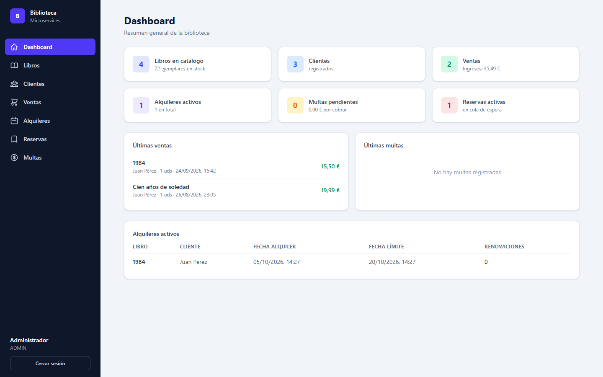
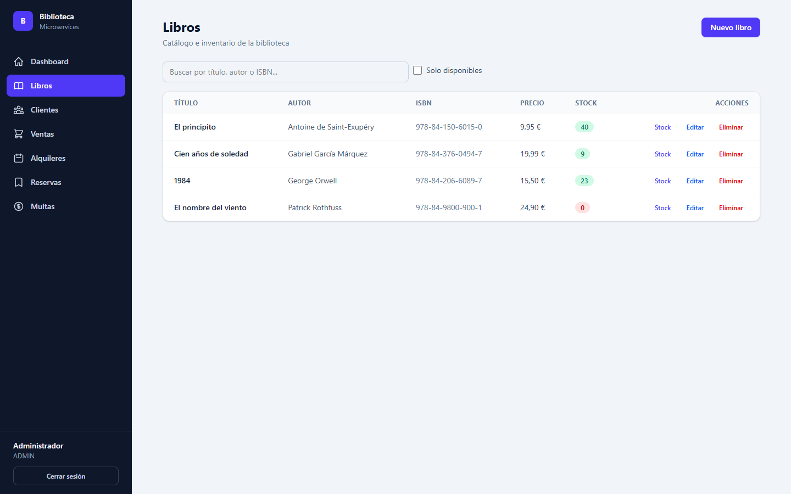
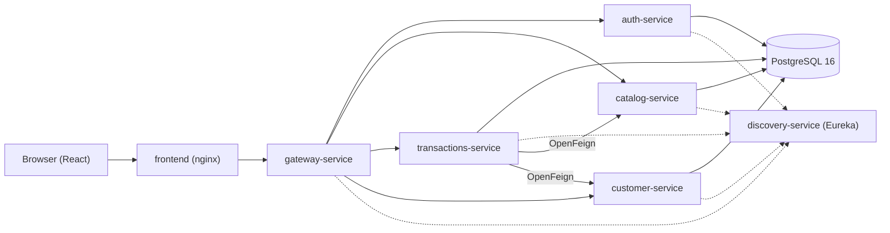

# Biblioteca Deploy


[](LICENSE)


Punto de entrada de la **plataforma de gestión de biblioteca**: un sistema de microservicios **Spring Cloud** con frontend **React** que se levanta completo con un solo comando. Este repositorio orquesta la base de datos PostgreSQL, los seis microservicios y el panel web.

## Capturas

| Dashboard | Libros |
|---|---|
|  |  |

| Ventas | Alquileres |
|---|---|
|  |  |

## Arquitectura



- El **frontend** habla solo con el gateway, que enruta por nombre (`lb://`) a cada servicio usando Eureka.
- **auth-service** firma los JWT (HS256) y el resto de servicios los validan por su cuenta con el `JWT_SECRET` compartido.
- **transactions-service** orquesta ventas, alquileres, reservas y multas llamando a catalog y customer con **OpenFeign**, propagando el token del usuario.

## Qué levanta

| Servicio | Contenedor | Puerto |
|---|---|---|
| PostgreSQL 16 | `biblioteca-postgres` | 5432 |
| discovery-service (Eureka) | `discovery-service` | 8761 |
| gateway-service | `gateway-service` | 8080 |
| catalog-service | `catalog-service` | 8081 |
| transactions-service | `transactions-service` | 8082 |
| customer-service | `customer-service` | 8083 |
| auth-service | `auth-service` | 8084 |
| biblioteca-frontend | `biblioteca-frontend` | 3000 |

Los microservicios esperan a que PostgreSQL y Eureka estén sanos antes de arrancar (healthchecks con `pg_isready` y `wget`). El frontend sirve el build de producción con nginx y proxifica `/api` hacia el gateway.

## Requisitos

- Docker + Docker Compose
- Los repositorios de los microservicios en carpetas hermanas de esta (como en el workspace original):

```
biblioteca-deploy/
├── docker-compose.yml
└── ...
discovery-service/
gateway-service/
catalog-service/
transactions-service/
customer-service/
auth-service/
biblioteca-frontend/
```

## Cómo usarlo

1. Copiar el archivo de ejemplo y rellenar las credenciales (incluido un `JWT_SECRET` propio):

```powershell
Copy-Item .env.example .env
```

2. Levantar el stack:

```powershell
docker compose up -d
```

3. Esperar a que los servicios estén sanos y comprobar Eureka en `http://localhost:8761` (deben verse los 6 microservicios registrados).

4. Cargar datos iniciales con los scripts (hacen login con el usuario ADMIN y envían el token):

```powershell
.\scripts-libros.ps1     # 3 libros de ejemplo
.\scripts-clientes.ps1   # 3 clientes de ejemplo
```

5. Abrir el panel en `http://localhost:3000` e iniciar sesión con el `ADMIN_EMAIL` / `ADMIN_PASSWORD` del `.env` (por defecto `admin@biblioteca.com` / `admin1234`). La API está en el gateway `http://localhost:8080`.

## Variables de entorno

El archivo `.env` (no versionado) define las credenciales y la configuración. Ver `.env.example`:

- `POSTGRES_USER`, `POSTGRES_PASSWORD`, `POSTGRES_DB` — superusuario de la base
- `DB_USER`, `DB_PASSWORD` — credenciales que usan los microservicios
- `DB_URL_CATALOG`, `DB_URL_TRANSACTIONS`, `DB_URL_CUSTOMER`, `DB_URL_AUTH` — URL JDBC de cada servicio
- `EUREKA_URL` — URL interna del servidor Eureka
- `JWT_SECRET` — secreto compartido para firmar y validar los JWT (mínimo 32 caracteres)
- `ADMIN_EMAIL`, `ADMIN_PASSWORD` — usuario ADMIN que auth-service crea al arrancar

## Estructura

- `docker-compose.yml` — definición de los 8 servicios
- `init-db.sql` — crea las bases de datos `transacciones`, `clientes` y `auth` (la de catálogo la crea PostgreSQL con `POSTGRES_DB`)
- `scripts-libros.ps1` / `scripts-clientes.ps1` — seed de datos de ejemplo vía el gateway (autenticados)
- `docs/screenshots/` — capturas del panel web
- `.env.example` — plantilla de variables de entorno

## Repositorios del sistema

| Repositorio | CI |
|---|---|
| [discovery-service](https://github.com/jjrmch/discovery-service) |  |
| [gateway-service](https://github.com/jjrmch/gateway-service) |  |
| [catalog-service](https://github.com/jjrmch/catalog-service) |  |
| [transactions-service](https://github.com/jjrmch/transactions-service) |  |
| [customer-service](https://github.com/jjrmch/customer-service) |  |
| [auth-service](https://github.com/jjrmch/auth-service) |  |
| [biblioteca-frontend](https://github.com/jjrmch/biblioteca-frontend) |  |

Los servicios backend suman **109 tests** (unitarios con JUnit 5 + Mockito e integración con Spring Boot + MockMvc + **Testcontainers** con PostgreSQL, incluido un test de concurrencia que prueba que el stock nunca queda negativo). Cada repositorio ejecuta su CI en GitHub Actions en cada push y pull request.

## Por mejorar

- Los scripts de seed no son idempotentes: si se ejecutan dos veces, duplican los datos.
- `docker compose up` reconstruye las imágenes Java desde cero (Maven sin caché de dependencias); se puede acelerar con un cache mount de BuildKit.
- Falta un despliegue de demo online; hoy el stack se levanta en local.

## Licencia

MIT. Ver [LICENSE](LICENSE).
